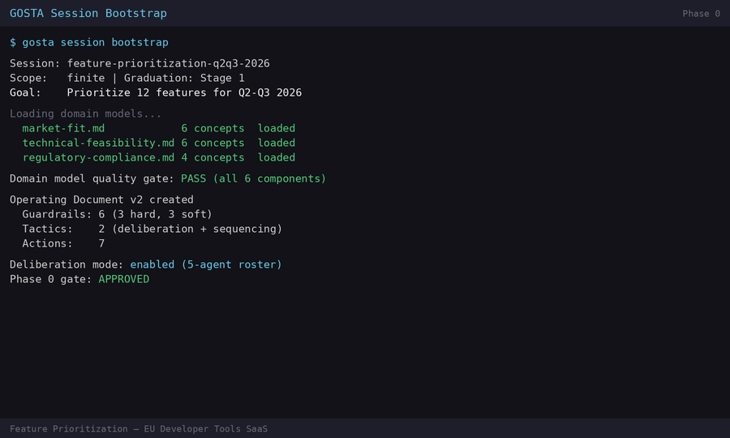

# GOSTA: Governance Specification for Autonomous AI Agent Execution

**Goals → Objectives → Strategies → Tactics → Actions**

GOSTA is an open specification for governing autonomous AI agents. It defines a five-layer control hierarchy — Goals, Objectives, Strategies, Tactics, Actions — with anti-hallucination grounding, graduated autonomy safeguards, structured memory, failure resilience, formal sycophancy detection, and human oversight at every decision boundary. The entire framework lives in a single file — drop it into any AI conversation and the AI has the complete specification. It is runnable today at Tier 0 (file-based, any conversational AI) and designed to scale to coded implementations at Tier 1–3.

Where orchestration frameworks (LangChain, LangGraph, CrewAI, AutoGen) define how agents execute tasks, GOSTA defines who decides what, within what bounds, what happens when things go wrong, and how the system proves its reasoning is sound. The distinction is not governance instead of orchestration — it is **orchestration with governance.**



**→ [Run your first GOSTA session in 10 minutes](docs/walkthrough.md)**

**Reading this README:** You don't need to read the whole thing. Pick your path:

| If you are... | Start with |
|---|---|
| **Using AI for decisions** (manager, founder, operator) | [Who Is It For](#who-is-it-for) → [Use Cases](#typical-use-cases) → [Get Started](#get-started) |
| **Building AI products** (developer, architect) | [How GOSTA Works](#how-gosta-works) → [Protocol Stack](#the-protocol-stack) → [Reading the Spec](#reading-the-spec) |
| **Evaluating the framework** (researcher, reviewer, funder) | [What's Novel](#whats-novel) → [Foundations](#foundations) → [Why Open Source](#why-open-source) → [Status](#status) → [What's Next](#whats-next) |
| **Contributing** | [Status](#status) → [What's Next](#whats-next) → [Contributing](#contributing) |

---

## Who Is It For

**Anyone using AI for decisions that matter.** If you're asking AI to help you decide something — what to build, who to hire, where to invest, which vendor to pick — and you need the reasoning to be traceable, grounded, and not hallucinated, GOSTA turns that conversation into a governed process.

**Organizations facing AI regulation** (EU AI Act, NIS2, sector-specific requirements). GOSTA's human oversight model, audit trail, guardrail architecture, and kill discipline map directly to regulatory requirements for risk management, record-keeping, transparency, and human oversight. The framework provides the architectural patterns that satisfy them.

**Public sector, research, and mission-driven organizations** where AI-assisted decisions carry public accountability — municipal planning, policy analysis, grant evaluation, NGO program design, healthcare governance, academic research governance. Every recommendation traces to a domain concept, every trade-off is documented, and the decision record exists independently of the AI session that produced it. For research groups, the same protocol applied to the same inputs produces auditable reasoning chains — making AI-assisted decisions reproducible and peer-reviewable.

**Teams building AI-powered products** where the AI makes or recommends decisions that affect users, customers, or operations. GOSTA provides the governance layer — guardrails, autonomy controls, health monitoring, failure handling — so the AI operates within defined bounds rather than on raw prompts.

**Founders, operators, and department leads** who use AI as strategist, analyst, or assistant. Whether you're figuring out what to build next, scoring leads, screening candidates, flagging expense anomalies, or running A/B tests on content — GOSTA turns scattered AI conversations into a structured decision process with grounded scoring, kill conditions on every bet, and session memory that persists across days.

---

## Typical Use Cases

GOSTA provides the governance structure — you bring the domain. These are patterns validated at Tier 0 (conversational AI sessions):

**Strategy and due diligence.** Evaluate a market entry, assess a technology stack, audit a vendor, analyze a policy — finite analytical scopes with phase gates, multi-agent deliberation across domains, and a formal decision record. The [feature-prioritization example](docs/examples/feature-prioritization/) shows a 12-feature evaluation with 4 domain agents and 5 hard disagreements.

**Public sector and policy analysis.** Municipal budget allocation, grant program evaluation, sustainability planning, regulatory impact assessment — any public-accountability context where decisions must be traceable, reasoning must be auditable, and the record must survive beyond the session.

**Product: feature roadmap and build-vs-buy.** Score candidate features across market fit, engineering cost, and regulatory compliance domains. Surface cross-domain tensions. Produce a ranked roadmap with every trade-off documented. The [walkthrough](docs/walkthrough.md) demonstrates this end-to-end.

**Finance: budget allocation and investment analysis.** Assess competing initiatives with domain-grounded scoring (ROI potential, risk exposure, strategic alignment), kill conditions for underperforming investments, and A/B testing between allocation strategies.

**Sales: pipeline and deal prioritization.** Score opportunities across domain models (buyer readiness, competitive positioning, deal economics), surface tensions between short-term revenue and strategic fit, produce a prioritized pipeline with every score grounded in defined criteria.

**HR: hiring decisions and workforce planning.** Evaluate candidates across multiple dimensions (skill fit, culture alignment, compensation benchmarking) with guardrails preventing bias, domain models encoding your hiring principles, and a formal decision record showing why each recommendation was made.

**Marketing and content operations.** Run AI-driven content with explicit goals, guardrails (brand voice, compliance), tactics with hypotheses, kill conditions, and health reports. A/B test content strategies at the tactic level. The Governor reviews what's working and kills what isn't.

**Daily operations.** Run recurring workflows at whatever cadence you set. The AI executes routine tasks within defined bounds (Stage 2–3 autonomy); you handle the exceptions. Guardrails persist across days, memory accumulates, health tracking catches degradation before failure, and every escalation follows a defined path.

**Personal decision-making.** Career moves, major purchases, relocation decisions, project planning — any personal decision complex enough to benefit from structured analysis across multiple dimensions with traceable reasoning.

---

## How GOSTA Works

### The Five Layers

| Layer | Question | Transformation | Owner |
|-------|----------|---------------|-------|
| **Goal** | Where are we going? | Vision → Constraint | Governor |
| **Objective** | What result, by when? | Direction → Measurement | Governor |
| **Strategy** | Why this approach? | Measurement → Reasoning | Governor |
| **Tactic** | How are we testing this? | Reasoning → Experimentation | AI / Tactic Lead |
| **Action** | Who does what, by when? | Experimentation → Execution | AI / Assignee |

Commands flow downward (goals constrain objectives, which constrain strategies). Feedback flows upward (actions emit signals, tactics aggregate them, strategies validate approach logic). Nine structural integrity rules enforce this hierarchy — no orphans, no layer contamination, single ownership, falsifiability, traceability, guardrail inheritance, feedback obligation, kill discipline, and layer boundary respect.

Five design principles govern the architecture:

- **Bidirectional information flow** — every layer both receives instructions and emits signals
- **Separation of reasoning from experimentation** — strategies can outlive killed tactics
- **Hypothesis-driven execution** — every tactic is a testable bet with a kill condition
- **Separation of intent from method** — upper layers say what and why, lower layers say how
- **Progressive autonomy with bounded risk** — each layer defines the decision space for the layer below

### The Operating Document

All five layers materialize in a single runtime artifact: the **Operating Document (OD)**. The OD contains the goal, objectives, strategies, tactics, actions, guardrails, domain models, health state, and decision log for a given scope. It is what the AI executes against, what the Governor reviews and steers, and what accumulates state across sessions. For analytical scopes (evaluate a vendor, prioritize a roadmap), the OD opens, runs through phases, and closes with a decision record. For operational scopes (daily sales outreach, weekly reporting), the OD persists indefinitely — tactics cycle, memory accumulates, health is tracked, but the scope keeps running.

### The Nine Subsystems

Beyond the five layers, nine subsystems make the control loop reliable:

**Guardrail Architecture** — Typed, inheritable, evaluable constraints. Each guardrail declares severity (hard violations halt execution; soft violations trigger review) and evaluation type (mechanical or interpretive). Guardrails inherit downward through the hierarchy and never relax as they propagate.

**Grounding & Hallucination Prevention** — A 5-category hallucination taxonomy (Form Corruption, Substance Corruption, Signal Corruption, Continuity Corruption, Reasoning Corruption — 12 specific types including parametric substitution) with 9 grounding components (8 core + Attribution as structural prerequisite). Collection-Stage Evidence Verification (§14.3.11) addresses LLM failure modes during evidence collection and deliberation: number confabulation, absence-as-evidence fallacy, selection bias, conflation, and parametric injection (agents introducing training-data claims that bypass the evidence pipeline). Eight checks (4 pre-deliberation + 4 in-deliberation) with 11 annotation types. Finding Classification and Sycophancy Detection are cross-cutting annotations that operate on top of the grounding layer, not grounding components themselves. The Governor curates **reference pools** to ground AI output in verified content rather than training data — see [Reference Pools](#reference-pools) below.

**Reasoning Integrity** — Checks whether the AI's reasoning is sound, not just whether its facts are correct. Depth validation, coverage analysis, chain integrity, finding classification (confirmed / information_gap / conditional), sycophancy detection, and mandatory confounder analysis before kill decisions.

**Decision Infrastructure** — Kill/pivot/persevere as the core decision framework. Health computation produces quantitative scores from aggregated signals. Decision-to-state traceability links every decision to the system state that motivated it. A/B testing at tactic and strategy levels. Multi-agent deliberation for decisions spanning multiple domains.

**Autonomy Model** — Five graduation stages from human-driven (Stage 1) through full autonomy within strategies (Stage 5). Nine categories of Governor authority are formally non-delegable at any stage — including goal changes, guardrail modification, kill overrides, and scope closure. Four safeguards constrain every stage: degraded-mode autonomy reduction, decision reversibility requirements, risk-magnitude thresholds, and conditional autonomy grants.

**Memory Architecture** — Seven memory types across three storage tiers (working, episodic, structural) with three functional cross-cuts (procedural, prospective, meta-memory). Defined loading sequences per agent type ensure agents load only what they need.

**Failure Resilience** — Six failure modes with detection, escalation, and restoration: signal pipeline failure, context and memory failure, capacity degradation, cascading failure propagation, Governor decision validation, and constraint propagation verification. A cross-cutting recovery verification mechanism prevents oscillation after any failure recovery.

**Environmental Signal Architecture** — Watch lists monitoring external conditions (competitor moves, regulatory changes, market shifts). Environmental signals carry distinct provenance and scale by tier.

**Structural Integrity** — Nine structural rules, semantic coherence validation, decision-to-state traceability, OD state versioning, feature interaction rules, eight interface contracts defining data flow between components, and nine pre-flight validation gates (V1-V9; V8 conditional on subagent-dispatch declaration; V9 conditional on inheritance declaration) that mechanically verify declared structures (retrieval contracts, build artifacts, decision spine, capture mode flags, runtime imports in orchestrator runtime, declared artifacts present-and-populated, inherited-artifact vertical fit (coverage), subagent-dispatch capability smoke at call-site environment, inherited-artifact framework-residue audit (the inverse-direction check on inherited artifacts)) are operationally true at every lifecycle boundary.

---

## The Protocol Stack

The specification defines what GOSTA is. Four operational protocols define how to run it.

**Cowork Protocol** — The Tier 0 execution protocol. How to run GOSTA with a session-based AI (Claude, ChatGPT, or any conversational AI) as orchestrator and executor. Defines session lifecycle, file structure, signal format, health computation, decision recording, phase gates, retrospectives, context management, graduation stages, quality checks, parallelism rules, and scope closure. This is what makes GOSTA runnable at Tier 0 — without it, the spec is theory.

**Deliberation Protocol** — Multi-agent coordination for cross-domain evaluation. Three roles: Domain Agents (each grounded in exactly one domain, advocates but does not resolve), Coordinator (manages agent lifecycle, identifies agreements and disagreements, does not advocate), and Governor (resolves disagreements, makes final decisions). Includes round mechanics, convergence and stall detection, cost tracking, and a 5-step graduated fallback for agent failures. Supports multi-model deliberation via MCP: domain agents can run on different LLM providers through Model Context Protocol servers, reducing shared base-model bias.

**OD Drafting Protocol** — Translates vague Governor intent into a well-formed Operating Document through structured questions. Takes "I want to grow revenue" to a complete 5-layer document with guardrails, hypotheses, kill conditions, and domain model grounding.

**Sync Manifest** — Tracks every derivation point between the specification and the protocols. When a spec section is updated, the manifest identifies which protocol sections need review.

### Reference Pools

The Governor curates reference pools — collections of source material (research documents, industry reports, raw data) that ground the AI's output in verified content rather than its training data. A bundled tool (`cowork/tools/pool-agent.py`) provides offline semantic search over any reference pool using a quantized embedding model — no external API calls required. It also supports indexing single large documents (specifications, regulatory texts) by section headings for targeted retrieval.

You don't need to operate the tool directly. At Tier 0, the Cowork Protocol (`startup.md`) instructs the AI assistant to build and query reference pools during sessions automatically. You curate what goes in; the protocol handles the rest. At Tier 1+, the tool's query interface integrates programmatically into the grounding pipeline.

<details>
<summary>First-time setup</summary>

The embedding model (~22MB) is not included in the repository. Run once after cloning:

```bash
pip install numpy pyyaml onnxruntime tokenizers huggingface-hub
python3 cowork/tools/pool-agent.py setup-model
```

This downloads all-MiniLM-L6-v2 from Hugging Face and quantizes it locally. No API keys needed. The startup bootstrapper (`startup.md`) checks for this automatically and will prompt you if it's missing.

</details>

<details>
<summary>CLI reference for direct use</summary>

```bash
# Build a vector store from your reference material
python3 pool-agent.py build --pool reference-pool.yaml --articles ./sources/ --store ./pool-store/

# Index a single large document by section headings
python3 pool-agent.py index-doc --doc spec.md --store ./spec-store/ --heading-level 2

# Verify a store is intact and not corrupted by Git LFS pointer issues
python3 pool-agent.py verify-store --store ./pool-store/

# Search the pool or document store during a session
python3 pool-agent.py query "hospital cybersecurity incidents" --store ./pool-store/ --top 10

# Add new material as your scope evolves
python3 pool-agent.py update --pool reference-pool.yaml --dir ./new-reports/ --store ./pool-store/

# Remove stale or irrelevant entries
python3 pool-agent.py delete --pool reference-pool.yaml --store ./pool-store/ --ids RP-042 RP-107

# See what's in your pool by tag
python3 pool-agent.py tags --pool reference-pool.yaml
```

</details>

---

## Get Started

**[→ Run your first GOSTA session in 10 minutes](docs/walkthrough.md)** — clone, paste one prompt, answer 6 questions, watch the AI score features against domain models under your governance. No code, no setup beyond git clone.

**[→ Understand the architecture first](docs/architecture-guide.md)** — five-layer hierarchy, implementation tiers, session lifecycle, health reports, and decision mechanics explained with diagrams.

**[→ Glossary](docs/glossary.md)** — terminology lookup (AFC, cite-then-apply, V-gates, hooks, U1 reviewer, Verdict Strength Annotation, etc.).

**[→ Is GOSTA right for this?](docs/is-gosta-right-for-this.md)** — self-assessment with yes-fit / no-fit signals, decision tree, and recommended starting points by problem profile.

**[→ FAQ](docs/faq.md)** | **[→ Troubleshooting](docs/troubleshooting.md)** — common questions, symptom-driven issue resolution.

**[→ Authoring Domain Models](docs/authoring-domain-models.md)** — walkthrough for writing your own domain model from scratch, with worked example and common-mistake annotations.

See also: **[Vendor-Product Continuity Assessment](docs/examples/vendor-product-continuity-assessment/)** (ready-to-run session template — 8 domain models, 4-agent deliberation, six-signal vendor viability framework). **[Feature Prioritization Example](docs/examples/feature-prioritization/)** (12 features, 4 domain agents, 5 hard disagreements, Governor decisions). **[CISO Roadmap — Five-Level AI Comparison](docs/examples/ciso-roadmap/)** (the same CISO planning question through 5 AI architectures, from generic prompt to governed deliberation — companion artifacts for the article "Five Ways to Collaborate on a Security Roadmap with AI").

---

## What's Novel

GOSTA was developed through systematic analysis of the emerging AI agent governance landscape. The frameworks analyzed during development span three layers:

**Autonomy and constraint research** — Levels of Autonomy for AI Agents (Knight First Amendment Institute, 2025), Agent Behavioral Contracts (arXiv, 2026), Agent Contracts (arXiv, 2025), trust-based delegation (MIT Media Lab), HAIF on human-AI hybrid team governance (Bara, 2026), Institutional AI on governance graphs and mechanism design (Sapienza/VU Amsterdam, 2026), and SAGA on security architecture for multi-agent systems (Northeastern, NDSS 2026).

**Industry and government governance** — Singapore's Model AI Governance Framework for Agentic AI (IMDA, 2026), Anthropic's Framework for Safe and Trustworthy Agents, and OpenAI's Bounded Autonomy model.

**Orchestration** — LangGraph, AutoGen, and DeerFlow on stateful execution and multi-agent coordination.

Each addresses a specific concern — autonomy classification, formal constraints, permission management, compliance checkpoints, hybrid team protocols, security infrastructure, or orchestration. GOSTA integrates across these concerns into a single operational architecture that connects strategic intent (goals, objectives) to execution governance (tactics, actions) through a five-layer control hierarchy. That integration produces mechanisms none of the individual approaches address:

**Hallucination taxonomy.** GOSTA formalizes 5 categories and 11 distinct types — from fabricated metrics to confabulated memories across sessions to reasoning that cites correct concepts but applies them shallowly. Each type has different causes, different detection methods, and different prevention mechanisms.

**Reasoning integrity as a first-class concern.** GOSTA checks the reasoning that produced outputs — not just the outputs themselves. Depth, coverage, chain integrity, and epistemic status of every claim. The system distinguishes between what it knows, what it doesn't know, and what it's assuming.

**Kill discipline with mandatory confounder analysis.** GOSTA requires a formal 6-point confounder analysis before every kill decision. This prevents premature termination of tactics that failed for reasons unrelated to their hypothesis — the most common failure in iterative AI systems.

**Sycophancy detection as a formal system risk.** Unlike grounding failures that produce incorrect content, sycophancy produces *correctly computed but misleadingly framed* content — the health score may be accurate while the narrative steers the Governor toward optimism. GOSTA formalizes six detection flags and treats this as the hardest bias to catch because it looks like good news.

**Autonomy that degrades gracefully.** Five stages with automatic autonomy reduction when grounding health degrades — the system loses independence precisely when its ability to reason reliably is compromised. This extends the autonomy classification work (Knight, trust-based delegation) by tying autonomy levels to a strategic hierarchy and making degradation automatic rather than discretionary.

**Bias treated as a structural concern.** The framework formally detects four bias types — compliance bias (sycophancy, six detection flags), pivot bias (loss aversion in kill decisions, measured at 4.3× pivot-over-kill in simulation), shared base-model bias in multi-agent deliberation, and recency bias in sequential agent processing — each with different causes, detection mechanisms, and architectural countermeasures. Confirmation bias and optimism bias are addressed indirectly through the sycophancy self-check and mandatory risk section rather than dedicated detection.

---

## Reading the Spec

The specification is 8,500+ lines covering 22 sections. It routes content to three reader roles:

**Governor** — the human with decision authority. Focus: §0–6, §8, §9, §13, §20–21.

**AI System** — the running orchestrator/executor. Focus: §7, §14, §17–20.

**AI Implementer** — the developer building the system at Tier 1+. Focus: §7, §14, §16–20.

**At Tier 0, the conversational AI IS both the AI System and the AI Implementer** — it simultaneously runs the system and constitutes its implementation.

Sections are tagged by feature complexity: **`[CORE]`** (required at any tier — five layers, structural rules, guardrails, execution loops, OD format, domain models, health basics, kill/pivot/persevere with confounder analysis), **`[ROBUST]`** (where most differentiated capabilities live — grounding architecture, memory, autonomy safeguards, failure resilience, A/B testing, sycophancy detection, semantic coherence, interface contracts), and **`[ADVANCED]`** (multi-scope hierarchies, Stage 4–5 autonomy, cascading failure propagation, shared memory).

Implementation tiers are independent of feature complexity:

- **Tier 0** — File-based, no code. A conversational AI is the orchestrator. All state lives in markdown files. Start here.
- **Tier 1** — Minimum viable coded product. Database, signal store, basic automation.
- **Tier 2** — Robust operations. Full grounding infrastructure, automated verification.
- **Tier 3** — Production-hardened. Multi-scope hierarchies, high autonomy, conversion funnels.

A Tier 0 user running deliberation needs `[ROBUST]` sections. A Tier 1 user building a simple single-domain scope may only need `[CORE]`. The complexity tags tell you what features to adopt; the tier tells you how to implement them.

---

## Repository Structure

```
GOSTA-OSS/
├── GOSTA-agentic-execution-architecture.md   ← The framework specification (8,500+ lines)
├── cowork/                        ← Operational protocols and session infrastructure
│   ├── gosta-cowork-protocol.md         Tier 0 execution protocol
│   ├── deliberation-protocol.md         Multi-agent deliberation
│   ├── evidence-collection-protocol.md  Evidence collection (§14.8 operationalization)
│   ├── od-drafting-protocol.md          Operating Document authoring
│   ├── domain-model-authoring-protocol.md  Source-to-domain-model extraction procedure
│   ├── sync-manifest.md                Framework-to-protocol derivation map
│   ├── verification-patterns.md         Decision verification patterns (universal + framework-change-specific)
│   ├── startup.md                      Interactive session bootstrapper
│   ├── session-launcher-template.md     Prompt template for session launch
│   ├── simulation-protocol-prompt.md    Structured simulation runner
│   ├── protocol-assessment-prompt.md    Six-dimension protocol assessment
│   ├── CLAUDE.md                       Claude Code/Cowork directive
│   ├── README.md                       Protocol directory overview
│   ├── templates/                ← Session templates (15 stub templates + hooks-settings.json)
│   ├── hooks/                    ← Claude Code hooks for automatic dispatch logging and closeout auditing (M1/M3/M4 mechanizable-discipline checks + log-dispatch + audit-closeout)
│   ├── evidence-archive/         ← Framework-level evidence archive (promoted from sessions)
│   └── tools/                    ← Reference pool agent (Python, offline semantic search, bundled ONNX model)
├── domain-models/
│   └── examples/                 ← Example domain models
├── docs/
│   ├── walkthrough.md            ← Run your first session in 10 minutes
│   ├── architecture-guide.md     ← Architecture guide (five layers, tiers, session lifecycle)
│   ├── images/                   ← Diagrams and animated GIFs
│   └── examples/                 ← Complete session examples with domain models
│       ├── my-first-session/                       ← Simplest example (2 domains, no deliberation)
│       ├── feature-prioritization/                 ← 4-agent deliberation example
│       ├── vendor-product-continuity-assessment/   ← Vendor viability session template (6 signals, 8 domains)
│       └── ciso-roadmap/                           ← Five-level AI comparison (article companion artifacts)
├── LICENSE                        ← MIT
├── README.md                      ← This file
└── CONTRIBUTING.md
```

---

## Foundations

GOSTA is not designed from scratch. The specification (§15) makes its theoretical substrate explicit and maps each foundation to the framework mechanism it underpins.

**Systems theory** — The five-layer hierarchy is a hierarchical control system. Stocks and flows model how signals accumulate and propagate. Balancing feedback loops drive tactics toward targets; reinforcing feedback loops are what the grounding architecture prevents from going negative. Gall's Law — complex systems that work evolve from simple systems that worked — is why the implementation sequence builds incrementally and the autonomy model starts at Stage 1.

**Control theory** — The Governor operates as a perceptual control system: goals externalize reference levels, the feedback loop compares current state to target, and the variance drives the next cycle. The entire architecture is a nested control loop where each layer controls the layer below.

**Experimental design** — Hypothesis-driven execution applies the scientific method to every tactic. A/B testing isolates causal signal. Confounder analysis prevents correlation-causation errors at kill decisions. Pre-committed kill conditions and what-must-be-true conditions are the framework's equivalent of pre-registered hypotheses — decision rules declared before the data arrives.

**Cognitive science** — The Governor's cognitive architecture (§15.5) is treated as part of the system, not external to it. Sycophancy detection exists because AI compliance bias exploits the human tendency toward confirmation bias. The autonomy model accounts for human attention as a finite resource — graduated autonomy is partly a response to the Governor's cognitive bandwidth.

**Regulatory alignment** — The framework's human oversight model, audit trail, guardrail architecture, and kill discipline align structurally with EU AI Act requirements for risk management, record-keeping, transparency, and human oversight. Failure resilience and recovery verification align with NIS2 resilience and incident handling requirements. GOSTA does not implement specific regulatory provisions — it provides the architectural patterns that map to them.

---

## Why Open Source

AI governance infrastructure should not be proprietary. When the rules that constrain autonomous AI are locked inside vendor platforms, organizations cannot audit them, modify them, or verify they work as claimed. GOSTA is open source because governance is a public interest problem — the infrastructure that makes AI trustworthy should be auditable, forkable, and owned by the organizations that depend on it.

The practical consequence is sovereignty. Organizations and startups adopting AI need governance they can adapt to their own domain, regulatory context, and risk appetite — not a one-size-fits-all platform they rent. Open-sourcing GOSTA puts that capability in the hands of anyone who needs it, regardless of budget, vendor relationship, or jurisdiction. Cybersol maintains the specification and Tier 0 protocols as part of its commercial practice — the open specification remains MIT-licensed indefinitely, and community governance evolves as adoption grows.

The final reason is validation. A governance framework for autonomous AI needs to be stress-tested against real-world scenarios its authors haven't imagined. Every organization that runs GOSTA against their own domain generates learnings that make the framework stronger. Open source turns users into contributors and real deployments into validation.

---

## Status

**Beta — Specification complete. Tier 0 usable. Tier 1 implementation next.**

GOSTA is a complete specification (v6.1, 8,500+ lines, 22 sections) with four operational protocols (Cowork, Deliberation, OD Drafting, Domain Model Authoring), 15 session templates, a verification-patterns reference, Claude Code hook scripts (M1/M3/M4 mechanizable-discipline + log-dispatch + audit-closeout), an independent-reviewer (U1) prompt template, example domain models, and a simulation test harness. The Tier 0 implementation — file-based, conversational AI as orchestrator — is usable today. You can run a governed session with any AI assistant by following the Cowork Protocol. No code, no infrastructure, no deployment. The framework targets Tier 3 (production-hardened, multi-scope, high autonomy) — it is currently validated at Tier 0, making this a beta release.

**What has been tested:** Eight simulation designs run by the authors covering operational scopes, analytical scopes (product roadmap sequencing, policy analysis), multi-agent deliberation (up to 10 agents, 3 rounds), and failure injection — 15 scenario runs producing 1,107 decisions total. Simulations measured a 4.3× pivot-over-kill bias ratio, confirming that the mandatory confounder analysis mechanism catches a measurable and common failure mode in iterative AI systems. These are internal validation — no external deployments yet. The simulation protocol (`cowork/simulation-protocol-prompt.md`) is included so others can run their own. The specification provides scaling guidance from simple scopes (20–40 items) through complex scopes (400–800 items across multiple domains).

**What does not exist yet:** Tier 1+ coded implementations. There is no database, no signal store, no orchestration engine, no dashboard. The specification defines the exact build sequence for Tier 1 (Phases 0–6) and graduation criteria for Tier 2–3, but no code has been written. This is the next major milestone.

---

## What's Next

The roadmap is organized as milestone-based deliverables across three tracks, scoped for incremental delivery with defined acceptance criteria per milestone.

**Tier 0 improvements — making GOSTA easier to use today:**

- **OD Drafting Protocol — full version** — The current release is a minimal guided process. The full version will give the Governor a structured, step-by-step experience for going from vague intent ("I want to grow revenue") to a complete Operating Document with guardrails, domain models, hypotheses, and kill conditions. This is the single highest-leverage improvement for adoption — it's where most new users will succeed or give up.
- **Guided domain model and reference pool authoring** — Currently domain models must be written from scratch. Guided creation (templates, structured interviews, validation) and a growing library of reference domain models for common use cases will lower the barrier from "read the spec and figure it out" to "answer these questions and get a working domain model."
- **Domain-specific worked examples** — End-to-end examples showing how a scope evolves across multiple sessions: a sales pipeline scope, an HR hiring scope, a daily operations scope. Examples teach faster than specification.
- **Public sector and sustainability scenarios** — Complete worked examples for municipal governance, NGO program evaluation, and sustainability planning — domains where AI governance carries public accountability and auditability requirements beyond the commercial cases.
- **EU AI Act compliance mapping** — A practical guide mapping GOSTA's architecture to EU AI Act requirements for risk management, record-keeping, transparency, and human oversight.
- **Session continuity tooling** — Better tooling for context management across sessions: bootstrap file generation, context compression, memory loading. This is the main practical friction at Tier 0 for multi-session scopes.

**Tier 1 reference implementation — making GOSTA programmable:**

- **Phases 0–6** — Database-backed Operating Document, signal store, schema validation, orchestration engine, domain knowledge store, and approval UI with governance loop. This turns GOSTA from a conversational protocol into infrastructure that code can build on.
- **Deliberation Protocol — production release** — Maturing based on real-world multi-agent sessions. Round mechanics, stall detection, and cost management need production validation.
- **Integration patterns** — Documented patterns for connecting GOSTA scopes to external data sources (CRM, analytics, financial feeds) — even at Tier 0, but especially at Tier 1 where signal collection can be automated.
- **Ecosystem integration architecture** — Study and integration architecture documents for connecting GOSTA governance to existing open-source tools and platforms.

**Community and ecosystem:**

- **Domain model library** — Community-contributed domain models for common domains (sales, HR, finance, product, marketing, compliance, public sector).
- **SME and startup adoption guides** — Practical step-by-step guides for small organizations adopting AI governance without dedicated AI teams.
- **Contributed examples and templates** — Real-world scope examples and domain-specific session templates from practitioners.
- **Tier 1 components** — Community-built modules for signal stores, health dashboards, and integration connectors.

---

## Disclaimer

GOSTA is a governance framework, not a guarantee. It provides the structure, mechanisms, and protocols for governing autonomous AI — but it does not warrant that any specific implementation will prevent hallucination, catch every failure, or produce correct decisions. The effectiveness of any GOSTA deployment depends on the Governor's choices: domain models, guardrails, kill conditions, and review cadence are human decisions the framework structures but does not make for you.

GOSTA governs the process, not the model. The framework defines what the AI should do — grounding checks, reasoning validation, sycophancy detection — but it cannot override the capabilities or limitations of the underlying AI model. If the model hallucinates, produces biased outputs, or fails to follow instructions, GOSTA's governance mechanisms may not catch every instance. The framework reduces risk; it does not eliminate it.

GOSTA does not constitute compliance with any regulation, including the EU AI Act, NIS2, or sector-specific requirements. The framework's architecture aligns with common regulatory themes, but using GOSTA does not certify legal compliance. Organizations are responsible for their own regulatory assessment. GOSTA output is not professional advice — the use cases described here are governance patterns, not substitutes for qualified legal, financial, or domain-specific counsel.

The Governor — the human with decision authority — retains full responsibility for all decisions made within the framework and all actions taken based on those decisions. Neither the framework authors nor contributors accept liability for outcomes resulting from the use of GOSTA. The framework is provided as-is under the MIT License, without warranty of any kind.

## License

MIT — see [LICENSE](LICENSE).

## Authors

GOSTA was created by [Cybersol B.V.](https://cybersol.nl), developed from production experience governing AI agents in cybersecurity and SaaS contexts. The specification, protocols, and tooling were authored collaboratively between human authors and AI systems — see [CONTRIBUTING.md](CONTRIBUTING.md#genai-disclosure) for the GenAI disclosure policy.

## Contributing

See [CONTRIBUTING.md](CONTRIBUTING.md).
