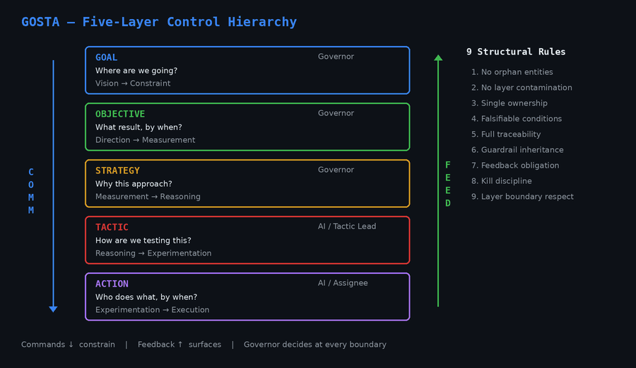
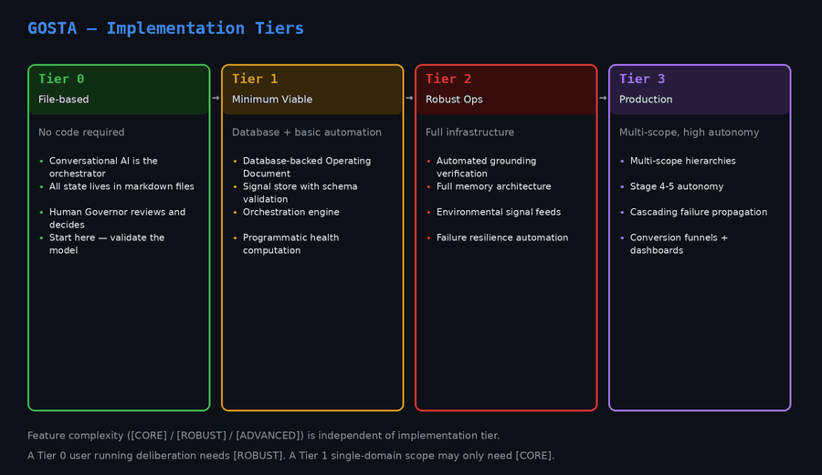

# GOSTA Architecture Guide

> **Status:** Beta — Specification complete. Tier 0 usable. Tier 1 implementation next.

This guide explains how GOSTA works — the five-layer hierarchy, implementation tiers, session lifecycle, and decision mechanics. Read it before or after the [hands-on walkthrough](walkthrough.md).

---

## The Five Layers

GOSTA organizes autonomous AI work into five layers:



**Commands flow down:** Your goal constrains what objectives are valid. Objectives constrain which strategies make sense. Strategies constrain which tactics to test. Tactics generate concrete actions.

**Feedback flows up:** Actions emit signals (data points). Tactics aggregate signals into health. Strategies validate approach logic against health data. The system surfaces structured recommendations to you.

**You are the Governor.** The AI drafts plans, executes within approved bounds, measures results, and recommends decisions. You approve, reject, or redirect. You never rubber-stamp — every decision point is structured with evidence, alternatives, and tensions.

---

## Implementation Tiers



Start with Tier 0. It requires nothing but files and a conversation. When you've validated the framework for your use case, you can invest in coded implementations (Tier 1+) that add automation, databases, and structured APIs — but the governance model stays the same.

---

## Core Documents

Before starting, skim these files (you don't need to memorize them — the AI reads them too):

| Document | What it contains | Time |
|----------|-----------------|------|
| `GOSTA-agentic-execution-architecture.md` §0 | Framework overview, tiers, how to read the spec | 10 min |
| `cowork/gosta-cowork-protocol.md` §1–5 | Session lifecycle, phases, gates | 15 min |
| `cowork/templates/operating-document.md` | What an Operating Document looks like | 5 min |

---

## How a Session Works

Every GOSTA session follows the same lifecycle. The [walkthrough](walkthrough.md) runs through this with a concrete scenario — below is the structure underneath.

### Starting a Session

There are three ways to start:

**Interactive bootstrap (recommended)** — Open a conversation with your AI assistant and say: *"Read cowork/startup.md and start a new session."* The AI asks you questions — session name, goal, scope type, complexity — and scaffolds everything.

**Template launch** — Open `cowork/session-launcher-template.md`, fill in the `{{PLACEHOLDER}}` values, paste it into a fresh AI conversation. The AI scaffolds the directory and begins Phase 0.

**Manual setup** — Create the session directory, copy templates and protocol files, then tell the AI to bootstrap:

```bash
mkdir -p sessions/my-project/{domain-models,reference,signals,health-reports,decisions,deliverables,session-logs}
cp cowork/templates/* sessions/my-project/
cp cowork/gosta-cowork-protocol.md cowork/CLAUDE.md sessions/my-project/
```

### The Bootstrap Phase (Phase 0)

The AI:

1. **Reads the framework and protocol** — building its understanding of GOSTA
2. **Asks you clarifying questions** — scope type, complexity, what you're trying to achieve
3. **Creates or loads domain models** — pluggable knowledge files that ground the AI's reasoning in your specific domain
4. **Drafts an Operating Document (OD)** — the single document that contains your goal, guardrails, objectives, strategies, tactics, and actions
5. **Presents the OD for your approval** — you review, request changes, and approve

The OD is the most important artifact. Everything downstream inherits its structure. Take the time to get it right.

Before execution begins, the AI presents a structured **Phase Gate Request**: Are all guardrails feasible? Are kill conditions discriminating? Is the domain model loaded and quality-gated? You approve, and execution begins.

### Execution Cycles (Phase 1+)

Each cycle follows the same pattern:

1. **Execute actions** — the AI performs the work defined in the OD
2. **Emit signals** — data points are logged (metrics, qualitative assessments, environmental changes)
3. **Compute health** — signals aggregate into a structured health report
4. **Present recommendations** — the AI recommends kill, pivot, or persevere for each tactic and strategy
5. **Governor decides** — you make the call at each phase gate

### Health Reports

Health reports use a traffic-light system:

| Status | Meaning |
|--------|---------|
| **GREEN** | On track. No action needed. |
| **AMBER** | Below projection but not critical. Monitor closely. |
| **RED** | Approaching or at kill threshold. Decision required. |

Every health report includes a signal-recommendation alignment check (are the recommendations consistent with the data?), risk factors (non-empty, substantive — not generic dismissals), and a sycophancy self-check (is the AI being over-optimistic?).

### Making Decisions

At each phase gate, you have three options for each tactic or strategy:

**Persevere** — continue as planned. **Pivot** — change approach while keeping the same hypothesis. **Kill** — stop this line of work entirely.

The AI presents each decision with evidence, alternatives, and tensions. Your job is to decide — not to accept the AI's recommendation uncritically.

Kill conditions exist to make kills mechanical — with bootstrap periods (don't evaluate too early), lag allowances (delayed metric impact), prerequisite checks (was the tactic actually executed?), and early triggers (kill before threshold if trajectory is unambiguous). This prevents both the sunk-cost fallacy and false kills from noisy or premature data.

### Session Closeout

When the scope is complete (finite scopes) or a major cycle ends (ongoing scopes):

1. **Final deliverables** are produced and accepted
2. **Retrospective** — what worked, what didn't, what surprised us
3. **Learnings extracted** — codified into `learnings.md` for future sessions
4. **Framework feedback** — any gaps or improvements logged for the framework itself

---

## Key Concepts

**The Operating Document is the single source of truth.** Everything the AI does flows from it. If the OD is wrong, everything downstream is wrong.

**Domain models prevent hallucination.** Without them, the AI reasons from general training data. With them, it reasons from codified domain knowledge with explicit quality principles and anti-patterns.

**Guardrails propagate downward.** A goal-level guardrail constrains every objective, strategy, tactic, and action beneath it. Hard guardrails cannot be violated. Soft guardrails can be violated with recovery.

**Signals flow upward.** Actions produce data. Tactics aggregate it. Strategies validate logic against it. Health reports synthesize everything into structured decisions.

**You are always in control.** The AI drafts, executes, measures, and recommends. You decide. Every decision is explicit, recorded, and reversible.

---

## Example Sessions

**[Run your first session](walkthrough.md)** — 10-minute hands-on walkthrough. Score 5 features across 2 domain models, test a hypothesis, make a governed decision.

**[Feature prioritization with deliberation](examples/feature-prioritization/)** — A multi-domain scope for an EU developer tools SaaS showing 3 domain models (market-fit, technical-feasibility, regulatory-compliance) with 16 core concepts, a 5-agent deliberation round with position papers, a synthesis report with 5 hard disagreements, and Governor decisions resolving market-vs-regulatory tensions.

---

## Next Steps

- **Try it:** [Run your first session](walkthrough.md)
- **Read the spec:** `GOSTA-agentic-execution-architecture.md` — start with §0
- **Create a domain model:** Use `cowork/templates/domain-model.md` as the template
- **Explore examples:** `domain-models/examples/` has two complete domain models
