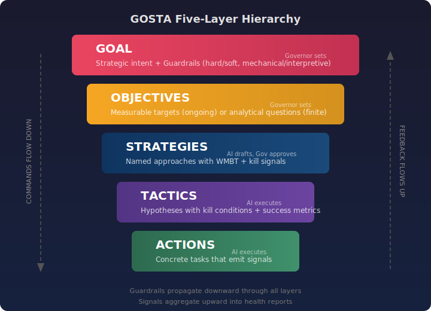
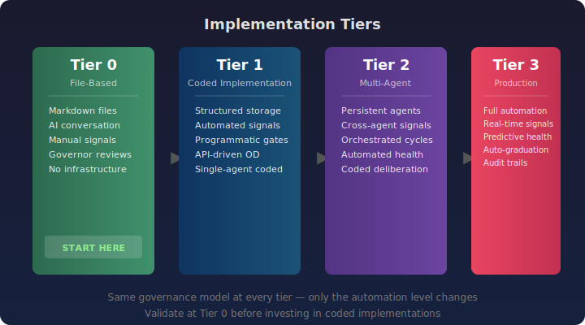

# GOSTA Quick Start Guide

> **Status:** Specification stable. Tier 0 validated. Tier 1 implementation next.

This guide walks you through running your first GOSTA session using Tier 0 (file-based, no code). You'll need any conversational AI tool — Claude, ChatGPT, or similar.

**Time required:** 30–60 minutes for your first session.

---

## What You'll Build

A complete GOSTA session that:
- Defines a goal with guardrails
- Breaks it into measurable objectives, strategies, and tactics
- Executes actions and emits signals
- Computes health and surfaces recommendations
- Presents structured decisions to you (the Governor)


---

## Step 1: Understand the Basics

GOSTA organizes autonomous AI work into five layers:



**Commands flow down:** Your goal constrains what objectives are valid. Objectives constrain which strategies make sense. Strategies constrain which tactics to test. Tactics generate concrete actions.

**Feedback flows up:** Actions emit signals (data points). Tactics aggregate signals into health. Strategies validate approach logic against health data. The system surfaces structured recommendations to you.

**You are the Governor.** The AI drafts plans, executes within approved bounds, measures results, and recommends decisions. You approve, reject, or redirect. You never rubber-stamp — every decision point is structured with evidence, alternatives, and tensions.

---

## Step 2: Read the Core Documents

Before starting, skim these files (you don't need to memorize them — the AI reads them too):

| Document | What it contains | Time |
|----------|-----------------|------|
| `GOSTA-agentic-execution-architecture.md` §0 | Framework overview, tiers, how to read the spec | 10 min |
| `cowork/gosta-cowork-protocol.md` §1–5 | Session lifecycle, phases, gates | 15 min |
| `cowork/templates/operating-document.md` | What an Operating Document looks like | 5 min |

---

## Step 3: Start a Session

### Option A: Interactive Bootstrap (Recommended)

Open a conversation with your AI assistant and say:

> Read `cowork/startup.md` and start a new session.

The AI will ask you a series of questions — session name, goal, scope type, complexity — and scaffold everything for you. This is the easiest path.

### Option B: Template Launch

1. Open `cowork/session-launcher-template.md`
2. Fill in the `{{PLACEHOLDER}}` values (goal, scope type, domain models, etc.)
3. Paste the filled template into a fresh AI conversation
4. The AI scaffolds the directory and begins Phase 0

### Option C: Manual Setup

```bash
# Create session directory
mkdir -p sessions/my-project/{domain-models,reference,signals,health-reports,decisions,deliverables,session-logs}

# Copy templates
cp cowork/templates/* sessions/my-project/

# Copy protocol and directive
cp cowork/gosta-cowork-protocol.md cowork/CLAUDE.md sessions/my-project/
```

Then tell the AI: *"Read the GOSTA cowork protocol and bootstrap a new session. Here's my goal: [describe what you're doing]."*

---

## Step 4: What Happens During Bootstrap (Phase 0)

The AI will:

1. **Read the framework and protocol** — building its understanding of GOSTA
2. **Ask you clarifying questions** — scope type, complexity, what you're trying to achieve
3. **Create or load domain models** — pluggable knowledge files that ground the AI's reasoning in your specific domain
4. **Draft an Operating Document (OD)** — the single document that contains your goal, guardrails, objectives, strategies, tactics, and actions
5. **Present the OD for your approval** — you review, request changes, and approve

The OD is the most important artifact. Everything downstream inherits its structure. Take the time to get it right.

### Phase Gate 0→1

Before execution begins, the AI presents a structured Phase Gate Request:
- Are all guardrails feasible given the available data?
- Are kill conditions discriminating (could they actually trigger)?
- Is the domain model loaded and quality-gated?

You approve, and execution begins.

---

## Step 5: Execution Cycles

Each cycle follows the same pattern:

1. **Execute actions** — the AI performs the work defined in the OD
2. **Emit signals** — data points are logged (metrics, qualitative assessments, environmental changes)
3. **Compute health** — signals aggregate into a structured health report
4. **Present recommendations** — the AI recommends kill, pivot, or persevere for each tactic and strategy
5. **Governor decides** — you make the call at each phase gate

### Reading a Health Report

Health reports use a traffic-light system:

| Status | Meaning |
|--------|---------|
| **GREEN** | On track. No action needed. |
| **AMBER** | Below projection but not critical. Monitor closely. |
| **RED** | Approaching or at kill threshold. Decision required. |

Every health report includes:
- Signal-recommendation alignment check (are the recommendations consistent with the data?)
- Risk factors (non-empty, substantive — not generic dismissals)
- Sycophancy self-check (is the AI being over-optimistic?)

---

## Step 6: Making Decisions

At each phase gate, you have three options for each tactic/strategy:

- **Persevere** — continue as planned
- **Pivot** — change approach while keeping the same hypothesis
- **Kill** — stop this line of work entirely

The AI presents each decision with evidence, alternatives, and tensions. Your job is to decide — not to accept the AI's recommendation uncritically.

Kill conditions exist to make kills mechanical: *"If metric X is below threshold Y after Z weeks, kill the tactic."* This prevents the sunk-cost fallacy from keeping failing approaches alive.

---

## Step 7: Closeout

When the scope is complete (finite scopes) or a major cycle ends (ongoing scopes):

1. **Final deliverables** are produced and accepted
2. **Retrospective** — what worked, what didn't, what surprised us
3. **Learnings extracted** — codified into `learnings.md` for future sessions
4. **Framework feedback** — any gaps or improvements logged for the framework itself

---

## Example Session

See the complete example in [`docs/examples/feature-prioritization/`](examples/feature-prioritization/) — a multi-domain feature prioritization scope for an EU developer tools SaaS, showing:

- 3 domain models (market-fit, technical-feasibility, regulatory-compliance) with 16 core concepts
- A full Operating Document with deliberation enabled (5-agent roster)
- 4 position papers from domain agents with cross-domain scoring of 12 features
- Coordinator interim assessment identifying 5 hard disagreements and 2 convergent features
- Synthesis report with 3 consensus features and 4 structured Governor decisions
- Governor decisions resolving market-vs-regulatory tensions, resource allocation trade-offs
- Health report with GREEN/AMBER status and sycophancy self-check
- Final deliverables: scored feature matrix and phased Q2–Q3 roadmap

---

## Key Concepts to Remember

**The Operating Document is the single source of truth.** Everything the AI does flows from it. If the OD is wrong, everything downstream is wrong.

**Domain models prevent hallucination.** Without them, the AI reasons from general training data. With them, it reasons from codified domain knowledge with explicit quality principles and anti-patterns.

**Guardrails propagate downward.** A goal-level guardrail constrains every objective, strategy, tactic, and action beneath it. Hard guardrails cannot be violated. Soft guardrails can be violated with recovery.

**Signals flow upward.** Actions produce data. Tactics aggregate it. Strategies validate logic against it. Health reports synthesize everything into structured decisions.

**You are always in control.** The AI drafts, executes, measures, and recommends. You decide. Every decision is explicit, recorded, and reversible.

---

## Implementation Tiers



Start with Tier 0. It requires nothing but files and a conversation. When you've validated the framework for your use case, you can invest in coded implementations (Tier 1+) that add automation, databases, and structured APIs — but the governance model stays the same.

---

## Next Steps

- **Read the spec:** `GOSTA-agentic-execution-architecture.md` — start with §0
- **Try a session:** Use `cowork/startup.md` to bootstrap interactively
- **Create a domain model:** Use `cowork/templates/domain-model.md` as the template
- **Explore examples:** `domain-models/examples/` has two complete domain models
